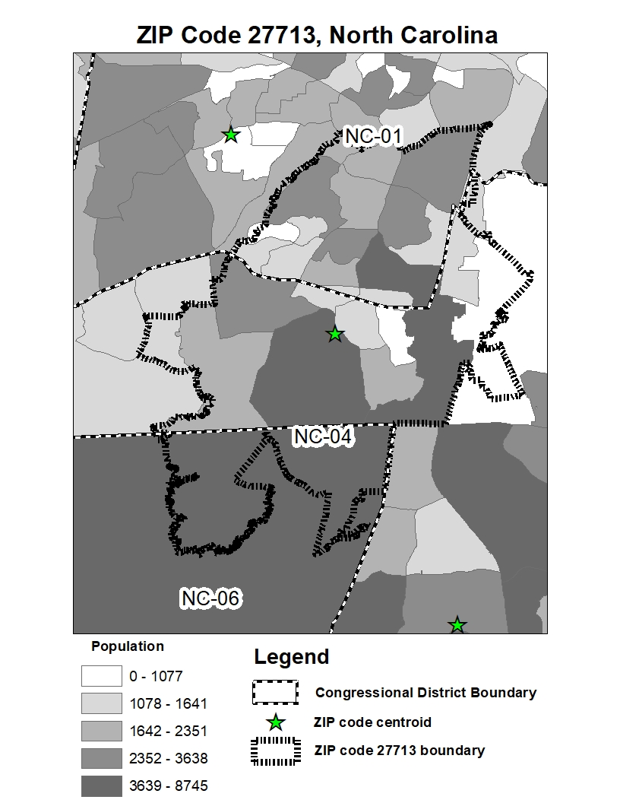

# arealOverlap2
# Areal Population Overlap
# Goal 

The script is designed to solve Modifiable Areal Unit Problems (MAUP) where one must find and determine the level of 
overlap between two different sets of poygons that are not perfectly nested within each other. MAUP becomes a serious issue whenever the user needs to determine how to allocate some unit of interest within some first level of geography (i.e. precincts, ZIP codes, state house districts, etc.) to some higher level of geography (i.e. State Senate districts, U.S. Congressional districts, etc.). A common problem might be how to allocate votes for a candidate from a precinct when the precinct is shared between several potential districts. Withough individual point data, it can be unclear as to how one might allocate vote totals across districts. 

  <figure>
  

 
    <figcaption>An example of a modifiable areal unit problem as applied to ZIP codes and congressional districts.</figcaption>
    

  </figure> 

The areal population overlap script addresses the issue of MAUP via overlaying the two geographies of interest on top of a census tabulation shapefile. The three way intersection is then calculated between the first level of geography of interest, the second level, and finally the census tabulation shapefile. The process results in three-part dyads. Population is apportioned based upon the level of geographic nesting of a census tabulation unit within the union between the first and second levels of geography. If a census tabulation unit is completely nested, then the entire population is allocated to the shared space. In the event of partial three way intersection arising from the census tabulation unit being split, then the population of the unit is weighted by its proportion within the unionized space. Note that while this method makes the assumption of uniform population distribution, it does so at the smallest possible level of geography in order to minimize the effect of the assumption. 

When using the script, it comes in two parts. First, a python toolbox created for ArcGIS products in order to process the the three way intersection and produce the raw spatial information to be processed, in addition to a dyadic table of the shared population overlap between the first and second levels of geography. The key outputs will be the dbf file, allTable1.dbf and all_merge3.dbf. The first will be of interest if the user simply wants the population overlap scores for the two levels of geograpghy of interest. The later is used in the second stage. 

The R script, arealOverlap2 contains functions to clean, combine and analyze the output of the python toolbox. Should the user want to add on additional census information beyond just population in order to find the sociodemographic data of the dyadic areas, the functions can do so. 
